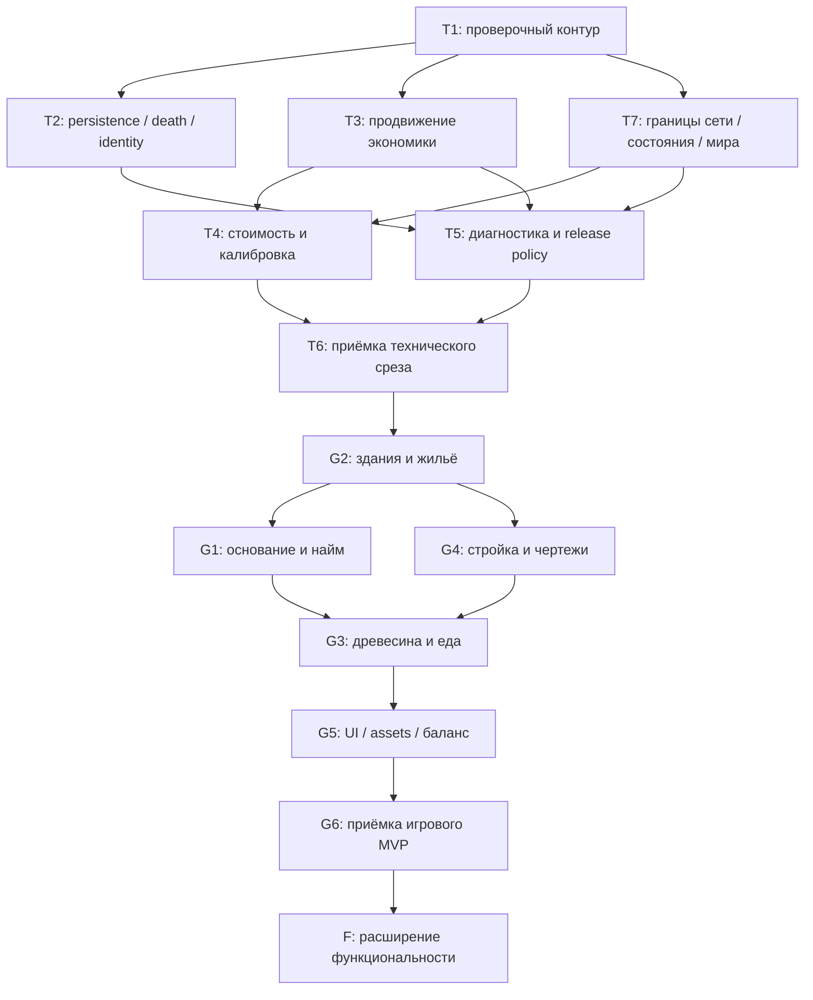

# Colonyloom — план разработки по результатам аудита

**Основание:** [аудит от 4 октября 2026 года](audit-2026-10-04.md), замечания A01–A29; [архитектура](architecture.md), особенно §§21–22. **Статус:** выполняемый план; реализация начата по запросу пользователя. Закрытие пакетов требует evidence ниже, не только наличия кода.

## 1. Цель и границы

Порядок: **безопасное сохранение → доказуемое продвижение экономики → принятый технический срез T → игровой survival MVP G → расширенный охват F**. Существующий модульный монолит сохраняется; отдельная экономика для новой профессии, переписывание runtime и преждевременный перенос на другой loader не планируются.

### Три контрольных результата

- **T — принятый технический срез.** Склад → запрос → производство → доставка → стройка на реальных предметах; безопасные cancellation/restart/recovery; согласованный профиль 300 жителей с продвижением ordinary и critical работ. Исходное сырьё может приносить игрок.
- **G — предлагаемый игровой MVP.** Non-op игрок в чистом survival мире основывает колонию, получает первых жителей, обеспечивает жильё, древесину и еду, строит полезные здания и управляет работой без dev-команд. Не менее часа проверенного игрового цикла; та же серверная экономика и права.
- **F — весь функциональный охват §2 архитектуры.** Дети/посетители, расписание/счастье, развитая добыча/производство, уровни/стили, обучение/исследования, медицина, оборона/рейды, квесты. Области не исключены из проекта; они вынесены в последующую очередь.

Состав G и bootstrap согласованы пользователем: oak/wheat, шесть зданий, физические ресурсы игрока без бесплатной выдачи. F остаётся полностью в плане; это выбор первого игрового цикла, не исключение расширенных требований. T выполняется до runtime cutover G.

### Исходное состояние по аудиту

219 core-тестов PASS; native suite 122/123 PASS, один отказ bounded pickup continuation (`Protected chunk domain cannot be replaced`). Compile conflict A01 уже исправлен пользователем: задача — verification gate, не повторное переименование. Scale на 300 жителей не принят. Риски missing DTO, death finality и recovery drops установлены статически; их runtime-сценарии ещё надо построить. Исторические отчёты не подтверждают будущие изменения.

### Текущая контрольная точка

- T1: `check assemble :colonyloom-neoforge:compileGameTestJava` PASS; 259 unit scenarios в 19 suites, failures/errors=0. `verificationManifest` создан со source/config/content SHA-256 и статусом `NOT_RUN`; это не runtime acceptance.
- Native handoff `native-guarded-continuation-20261004f`: 153/153 required PASS; execution report подтверждает unchanged source/config/content (`8ebee43…`). После исправления carried-food planning свежий sequential root build и native suite: 154/154 required PASS (`artifact://1360`). Exact query count удалён как incidental assumption: все 63 original goals/property и unchanged search quotas/deadline остаются проверяемыми.
- Dedicated loss-pairs, production initialize/exercise/verify и needs exercise/verify PASS на handoff snapshot. `storage-1791146249331`: exercise/clean-restart/full calibration PASS; 300 s warmup, 600.298 s measurement, десять positive activity windows, 166 actual batches, 996 planks → 664 stairs. Graph 844 calls, p99 0.294911 ms; native storage 1,740,599 calls, p99 0.016895 ms. Carried-food planning использует authoritative registered subject inventory и existing local reservation, не pickup inventory-to-itself. First-mutation `first-mutation-1791145583709` PASS: genuine halt(97), durable marker/absent DTO, same-world restart refusal и unchanged marker bytes. `management-1791147349831` FAIL из-за Windows shared-clock file replacement; dev clock заменён пассивным наблюдением native time packets, полный graphical повтор ожидает интеграции текущих slices. Изменение source hash требует новых matching calibration prerequisites перед scale; прежний storage PASS не сертифицирует новый snapshot.
- Текущий food diagnostic fix: Java smoke воспроизвёл `Unknown delivery` при PROMISED_OUTPUT bread, затем подтвердил MATERIALS без изменения authority, сохранённое covered=1 и producer recipe после restore. `NeedsController.reason` различает producer/delivery UUID; native NBT regression добавлен, полный текущий suite ещё не выполнялся. Новые identity-overflow, retirement и integrated lifecycle slices требуют общей повторной приёмки; предыдущие calibration hashes их не покрывают.
- Pure-model smoke текущего compiled core подтвердил 512 disjoint claim grants/8192 оплаченных links и освобождение leases; измеренный synchronous restore 149.8285 ms не является native MSPT/performance acceptance. Food precedence smoke подтвердил отказ ordinary assignment при pending food до/после restore и возвращение ordinary assignment после terminal food retirement. Временные исходники удалены; постоянные boundary regressions остаются в suites.
- Actual graphical `integrated-1791160185884` PASS на неизменном source/config/content snapshot: один client JVM прошёл A1 → пустой B → тот же A2; все три остановки имеют matching clean DTO/marker и `activeRuntimes=0`. Исходные citizen/entity UUID, epoch=1 и семь stairs сохранены; startup clock равен checkpoint, resumed clock не идёт назад. Проверен framebuffer production summary 1280×720. Это lifecycle proof технического среза, не Gate T/300-resident acceptance и не survival recruitment.
- `identity-overflow-1791160322219`: initialize/exercise physical facts, normal clean checkpoints и runtime release прошли; runner отказал после exercise из-за изменившегося source provenance. Verify-фаза не запускалась. Это diagnostic evidence, не закрытие A10; полный three-phase run требуется после source freeze.
- Frozen retirement integration: `check assemble verificationManifest` PASS; 261 core + 3 Minecraft-module unit scenarios, failures/errors/skips=0. Native/recovery matrix запущена последовательно. Production terminal count/assignment index обновляются при всех переходах и restore; checkpoint retirement проверяет до 32 indexed candidates по rotating cursor, сохраняя live output/evidence/obligations. Это compile/model evidence, не завершение Gate T.
- `1e394e217…` native/integrity snapshot: 155/155 required GameTests PASS; `identity-overflow-1791163300985` initialize/exercise/verify PASS (64 facts), `dedicated-1791163388467` loss-pairs PASS, `first-mutation-1791163503927` genuine halt(97)/restart PASS, `production-1791163561172` и `needs-1791163729974` все фазы PASS. `delivery-1791163806677` FAIL step=10: native saved return barrel содержит все 12 planks, order RETURNED/cargo empty; fixture перекрыл четыре клетки, оставив supported diagonal/distance-two approaches. Fixture теперь перекрывает полный 5×5 ring; delivery/recovery проверяются заново, previous snapshot не считается final current acceptance.
- `8c83d6896...` revised fixture snapshot: `delivery-1791164362675` exercise/verify PASS (17 facts); `construction-1791164500855` clean/cancel и четыре genuine crash/restart сценария PASS. `recovery-1791165137409`: все 14 transfer/craft/food сценариев прошли initialize/exercise/verify/accept; полный runner FAIL в `death_clean`. Первый late-LOWEST veto сохранил alive authority и семь предметов, но немедленный второй native hit вернул false. Death fixture теперь ждёт окончания vanilla hurt cooldown через настоящие ticks без сброса native полей; пять death-сценариев проверяются отдельно на frozen snapshot. Previous reports остаются diagnostic для изменённого source, не current Gate T.
- Death cooldown run `recovery-1791168178778`: clean/before-effect/source-change все фазы PASS. Destination-change accept выявил вторую dev-only ошибку: strict property logger запрещал временный dirt внутри намеренного changed-drop probe до его восстановления. `recovery-1791169530317` на `a9662b121...`: destination-change/fact-before-notify все восемь фаз PASS, включая genuine halt(97), same-world verify/accept, отказ changed/removed UUID после inspect и native exact clean-checkpoint counts. Probe теперь восстанавливает тот же объект/stack в `finally` до property logging; production accept policy неизменна. Current actual two-client management calibration запущена, Gate T остаётся открытым до полного source-matched runtime/load набора.
- `management-1791169787671` на `a9662b121...` PASS: настоящий dedicated server и два graphical non-op клиента; owner/viewer facts 34/20, сервер 471, failures=0. Wire burst из 100 resync дал два close (один RATE_LIMIT), privatePages=0; loss/resync, ACK timeout, revoke in-flight, respawn/reconnect без replay и cleared owner form подтверждены. Проверены framebuffer owner summary и viewer access-denied 1100×760. Full view calibration: 300 s warmup, 600.0564685 s measurement, 23983 units, p99=51199 ns, 9 positive windows, четыре ordinary-ACK views на клиента. Full platform → native stock calibration запущены последовательно; current scale acceptance ещё не выполнен.
- Read-only T2/T7 review: T7 current paths имеют bounds/rotation/exhaustion contracts; remaining runtime/load acceptance не заменяется review. T2 выявил opaque citizen history scope bug: два допустимых 600-row histories либо opaque600+UNKNOWN1 глобально отказывали при restore. Native failing-before `native-opaque-history-before`: 155 PASS + ровно два новых required FAIL; after fix `native-opaque-history-after`: `check assemble` и 157/157 required PASS. Binding rows opaque citizens сохраняются исходным NBT под original colony cap; true UNKNOWN остаётся отдельным scope. Native join/unload retained citizen не публикует duplicate row; quotas/retired UUIDs не меняются. Platform run остановлен до source mutation; прежняя graphical calibration не покрывает новый source hash. Полный frozen acceptance набор требуется заново.
- Frozen snapshot `50ddce5a8652270d7aca72f071f410eaac335574032a36a5e8aec05a8e53fe49`: `check assemble verificationManifest` PASS; `native-opaque-embodiment-current` 158/158 required PASS. Новый actual `addFreshEntity` → `UNLOADED_TO_CHUNK` regression сохранил opaque NBT, live binding authority и три физических bread; native join/unload guard теперь проверен, а не только описан. Последовательно запущены integrated, identity overflow, dedicated loss-pairs, first mutation, delivery/production/needs, полная construction/recovery matrix, graphical view calibration, full platform и native storage calibration. Source/config/content заморожены; Gate T остаётся открытым до completed reports и полного scale.
- T5 current native evidence: scoped metadata/type/object/dependency без raw payload, 40 opaque records → 32 diagnostic rows без trimming сохранения, capacity-buffer и search-exhaustion projections, root migration/immutable backup и future-schema refusal входят в 158/158 PASS. `operations.md` содержит supported subset, bootstrap, stop/backup/downgrade и inspect/accept без компенсации; `verification.md` — reproducible commands и archive policy. Release `colonyloom-0.1.0.jar` SHA-256 `ab43708cd4da761bade4f7e3bbf08c98d715b735880f8f88d2c1bc0d4fb50d90`: только четыре production package слоя, assets/data/LICENSE и mod descriptor; dev gametest/scenario classes отсутствуют. Unit XML текущей сборки: 261 core + 3 Minecraft, 19 suites, failures/errors/skips=0; в последнем build unit tasks UP-TO-DATE, не новый повторный запуск.
- `50ddce5a…` completed integrity/lifecycle: `integrated-1791172128450` actual graphical A1→B→A2 PASS (Ready framebuffer 1280×720 осмотрен; семь stairs/исходные UUID/epoch, три clean stop/runtime release); `identity-overflow-1791172223458` 3/3 phases, 64 facts PASS; `dedicated-1791172333700` production-only и loss-pairs PASS; `first-mutation-1791172492627` genuine halt(97)/same-world refusal PASS. `delivery-1791172559679` 2/2, `production-1791172749383` 3/3, `needs-1791172928822` 2/2 PASS. `construction-1791173015674` 18/18 phases PASS; `recovery-1791173893002` все 19 сценариев/72 phases PASS, включая late death veto, independently persisted source/destination/fact, changed/removed drops и inspect/accept races. Reports имеют matching hashes и checkoutUnchanged; T2 закрыт. T3 остаётся открытым до full scale progress. Graphical calibration `management-1791176524002` ещё выполняется; platform/storage/scale не приняты.
- `50ddce5a…` graphical `management-1791176524002` завершён: server/owner/viewer 460/34/20 facts PASS; проверены actual owner summary и denied viewer framebuffer 1100×760. View calibration: 300 s warmup, 600.0432465 s measurement, 23976 units, p99=81919 ns, 9 positive windows. `platform-1791177641306` baseline PASS, idle30 FAIL до warmup: dev fixture основал три 128×128 территории одним actor в одном tick, второй public command получил штатный `FOUNDING_VALIDATION_LIMIT`. Platform/scale setup теперь основывают по одной территории через реальные 20-tick окна; production guard/лимиты/acceptance durations неизменны. На новом source `79107424…` `check assemble verificationManifest` PASS (unit tasks UP-TO-DATE); actual `platform-1791178796961` idle30 diagnostic PASS: три исходные территории, 30 native citizens, 42 warmup/101 measurement ticks. Это failing-before/passing-after smoke, не full barrier; старые hashes не переписываются, source-matched calibration требуется заново.
- Current T3 diagnosis: `native-t3-current-20261005` on `cd44819e…` passed158/159; only `waitingRouteRebuildsDomainAfterNativeDisplacement` failed with stale-domain UNREACHABLE after a legitimate native position change. Existing300-original reactivation and63-route scarce-consumer proofs passed; the historical scale artifact lacks current cursor diagnostics/provenance and cannot establish their recurrence. Waiting discovery/queued search now rebuild changed domains through existing admission while preserving the same request/goal/assignee/epoch; no budgets/deadlines/readiness guards changed. New core negative-retry regression failed before the fix. `check assemble` plus `native-t3-displacement-fixed-20261005` passed159/159 required on unchanged source `1ceb09778858b043fedc98da4d85ac028d5f8115241a02be6a89a5e39954972f`; execution `runGameTestServer-execution-1791198116674/report.json` passed with matching source/content/config. Full platform/storage/view calibration and300-resident acceptance remain open.
- G/F не исключены и не объявлены выполненными. Состав контента не расширяется до Gate T; исторический scale PASS не применяется к изменённым исходникам.

## 2. Оценка и ресурсный план

Числа перенесены из аудита: **инженерные оценки [INFERENCE]**, а не velocity или обещанная дата. Один знакомый с проектом Java/Minecraft разработчик; человеко-день = 8 часов сосредоточенной работы. Оценки включают реализацию, проверки и необходимые docs. Диапазоны отдельных Axx не суммировать с пакетами второй раз.

| Результат | Добавочные человеко-дни | Всего от среза аудита | Календарный ориентир одного разработчика |
|---|---:|---:|---|
| T — техническая приёмка | 34–69 | 34–69 | 9–18 недель |
| G — survival MVP поверх T | 38–63 | 72–132 | 4–8 месяцев |
| F — расширенный охват поверх G | 130–260 | 202–392 | 12–24 месяца |

Календарные диапазоны учитывают прерывания, ревью и повторные прогоны. Для двух разработчиков G: ориентир 3–6 месяцев, не деление труда пополам. После T3 требуется переоценка: причина масштабного зависания пока не доказана. Существенные изменения схемы смерти/сохранения могут потребовать пересмотра T2, а не скрытого урезания проверки.

## 3. Зависимости и порядок

Нумерация T/G сохранена из аудита для сопоставления оценок; это не порядок начала. **Для одного разработчика:** T1 → A03 → A20/T3 → остальной T2 → T7 → T4 → T5 → T6 → G2 → G1 → G4 → G3 → G5 → G6. Черновик решений G и UI можно готовить раньше; расширять игровой каталог до принятия T нельзя.

**Для двух:** после T1 разработчик A ведёт T2, разработчик B — T3; T7 делится по независимым network/world участкам. Один владелец интегрирует изменения общих registry/admission/chunk contracts. Тяжёлые измерения на одной машине выполняются последовательно; конкурентный запуск серверов не считается валидной калибровкой.

## 4. Технический этап T — 34–69 человеко-дней

### T1. Воспроизводимый проверочный контур — 1–2 дня

**Замечания:** A01; подготовка A15. **Участки:** root `build.gradle`, `colonyloom-neoforge/build.gradle`, текущие verification tasks.

1. Включить компиляцию native test source set в обязательный verification gate, сохранив отделение долгих runtime-прогонов от быстрой компиляции.
2. Зафиксировать команды core/native/dedicated/recovery/platform/scale, prerequisites, disposable worlds и порядок запуска. Не подставлять ignored timestamp paths как доказательства чистого checkout.
3. Определить acceptance profile **до** новых измерений: hardware/JDK/heap, 3×100 жителей, состав работ и чанков, warmup/measurement/drain, MSPT tails, critical deadlines, index freshness, state bounds и условия progress. Непринятые числовые пороги не придумывать по результату прогона.
4. Привязать результаты к source/config/content hashes; FAILED и пустую выборку отделять от PASS.

**Готово:** чистый checkout компилирует main и native suites; другой разработчик может воспроизвести запуск по инструкции и получить manifest. Известный A20 остаётся зарегистрированным отказом, не скрывается настройкой gate. Existing source set compile fix не выполняется повторно.

### T2. Persistence, смерть и identity — 7–14 дней

**Замечания:** A03–A05, A10; schema-часть A11. **Участки:** `ColonyPersistence`, `DurableNbt`, `RegistryNbt`, `CitizenEntity`, `IdentityPlatform`, `ColonyloomMod`, `BindingRegistry`, effect/recovery commands.

1. **Первым A03:** virgin world допустим только при отсутствии DTO и marker. Missing/corrupt DTO при наличии marker — unavailable/recovery, не пустой активный runtime. Не переписывать утраченное состояние новым snapshot.
2. Зафиксировать таблицу исходов смерти: подготовка, поздняя отмена события, подтверждённая смерть, source removal, drops publication, crash, restart, inspect/accept. Выбрать надёжную точку finality; если hook недостаточен — явный двухфазный state, не предположение по LOWEST priority.
3. Death-specific recovery показывает источник, состав cargo, сопоставленные drops и UNKNOWN. Изменение/подбор drops после inspect не должно превращаться в ложное подтверждение unchanged destination. Сохранить запрет автоматического replay/компенсации.
4. Overflow observation history — явный scoped отказ и операторский recovery; отсутствие влияния на незатронутые колонии проверить. Не чистить retired UUID без устойчивой защиты от поздней загрузки старого entity. Dedicated `identityOverflowSmoke` uses the real public founding/citizen commands, a marked disposable world, a genuine `addFreshEntity` duplicate and a staged restore of 599 retired observations belonging to one DEAD historical citizen plus the original live observation. It proves `identityHistory=600/600`, unrecorded UUID/cargo inspection, accept refusal before non-destructive `UNLOADED_TO_CHUNK` removal, fresh inspect/accept without compensation, scoped B availability, clean same-world restart, and late retired-UUID quarantine/property custody. No `spawn600` shortcut or retired-row deletion is valid evidence.
5. Если меняется формат, определить конкретную миграцию и immutable backup до записи нового DTO. Generic migration framework не вводить.

**Проверки:** first mutation → durable dirty marker → авария до DTO; missing/corrupt пары файлов; late death veto; crash points source/destination/fact; удалённые/изменённые drops; inspect/accept race; duplicate/retired incarnation; history cap. Для каждого сценария проверять physical property и canonical state, не только отсутствие exception. Overflow runner phases are `initialize`, `exercise`, `verify`; each phase must end through normal stop with clean checkpoint/runtime release, and provenance must remain unchanged.

**Готово:** мир не стартует пустым после признаков прежнего состояния; физически живой NPC не становится окончательно DEAD из-за отменённого event; recovery честно показывает неопределённость; повторная загрузка не создаёт предметы; scoped identity overflow и migration policy доказаны сценариями.

### T3. Продвижение экономики и bounded pickup — 8–18 дней

**Замечания:** A02, A06, A14, A20. **Участки:** `SupplyRegistry`/`SupplyPlanner`, scheduler/wakeup, `NeedsController`, native delivery/production, `ChunkDemandManager`, navigation.

1. Разобрать A20 по конкретному caller/owner: old/new domain, physicalStep, unsafeCargo, critical lane, stage и момент release. Защищённую domain нельзя менять снятием guard; исправляется переход владельца/заявки или fixture, если доказано, что нарушитель — fixture.
2. В failed scale evidence разобрать oldest **разрешимые** goals: demand/coverage/allocation, worker, cargo, destination capacity, admitted domain, navigation, dirty registration. Составить причинную цепочку блокировки; хорошее MSPT не диагностирует stall.
3. Исправлять доказанные lifecycle/wakeup/frontier/admission причины. Не делать отдельные retry loops или специальные исключения для тестового input. Не повышать budgets/deadlines ради PASS.
4. Заменить recurring full scans на имеющиеся индексы либо budgeted cursors. Сохранить dirty/pending при полном queue и при изменении между проверкой и регистрацией ожидания.
5. Для capacity-blocked cargo вывести конкретный buffer и безопасное действие игрока; освобождение места пробуждает work. Новые pickups не должны усугублять занятость единственного курьера. Cargo не удаляется и не объявляется доставленным логически.

**Проверки:** строгий bounded pickup/stale candidate; repeated batches; shared cancellation; полные destination/return/source; critical food при насыщении normal graph; ordinary progress; noNotify arrival; domain swap с cargo; изменённый/перекрытый путь; повторный запуск с UNKNOWN cargo.

**Готово:** A20 закрыт доказанным исправлением; native цепь расходует реальные доставленные предметы; на согласованном profile не остаются вечные разрешимые цели. На выходе T3 фиксируется причина каждого прежнего stall и переоценивается остаток; итоговая нагрузочная сертификация — T6.

### T7. Границы сети, состояния и мира — 7–14 дней

**Замечания:** A21–A23, A25–A29. Начинается после T1; завершается до окончательной калибровки T4/T6.

| Работа | Реализация и критерий выхода |
|---|---|
| A21 — subscriptions/resync | Per-session rate bound и дедупликация ошибочных ответов; cap 4 views, ACK timeout, shared row budget и немедленная проверка прав сохранены. Burst/resync/revoke не удерживают stale view и не создают response flood. |
| A22 — membership | Явный согласованный cap в admission/command/restore; UI показывает предел. Превышение отказывает до изменения membership/authority revision, snapshot остаётся прежним. |
| A23 — founding | Ранняя capacity check; bounded/порционная world validation. До завершения нет опубликованной colony или необратимых обязательств; несколько клиентов делят глобальный budget. |
| A25 — shared chunk attribution | Global unique footprint учитывается один раз; доли colony/lane учитываются независимо от первого owner. Acquire/release/limit reduction проверяются между колониями и lanes. |
| A26 — navigation exhaustion | Node-cap/вычислительный отказ отличается от доказанного UNREACHABLE в результате, retry и UI. Проходимый сложный маршрут не маскируется как доказанно отсутствующий. |
| A27 — blueprint preparation | Bounded segments или pinned transform cache вместо полного синхронного layout. Bounds/territory/claims проверяются до материальных обязательств; анализ не загружает чанки. Максимальный допустимый blueprint измерен. |
| A28 — claim restore | Устранены повторные pair checks либо введено quiescent staging; publish только после полной проверки конфликтов. Startup на плотном предельном наборе измерен. |
| A29 — rotation | Реальная стройка на 90° и 270°: states, coordinates, markers, claims, materials; выход за territory/bounds отказывает до work creation. |

**Готово:** сценарии границ проходят, размеры принятого state ограничены до мутации, expensive paths имеют проверяемый cost bound. Общие изменения contract мигрируют все callers/DTO/UI, без совместимых дублей старого пути.

### T4. Hot path, хвосты и калибровка — 4–8 дней

**Замечания:** A07, A08, A15; измерительная часть A06/A26/A27. **Участки:** citizen clocks/position, native tick, persistence/compaction, runtime metrics, calibration tasks.

1. Не копировать unchanged maps на каждом active tick; сохранить owner-thread authority, inactive pause, control revision и transport revision semantics. Проверить отсутствие догоняющего голода после неактивности.
2. Измерять save/compaction/flush отдельно от managed tick. Оптимизировать подготовку/периодичность только сохраняя durable force/verify и порядок checkpoint → compaction → snapshot.
3. Выполнить воспроизводимую platform matrix: покой/движение/коллизии/доступный бой, ground navigation, chunk saturation и последствия реального block placement. Новый backend требует новой source-matched выборки.
4. Получить per-unit calibration из полного согласованного measurement, не коротких прошлых reports. Артефакт содержит source/config/content hashes, распределения/выборки, hardware, duration и статус каждого prerequisite.

**Готово:** full platform prerequisite принят; caps и quanta обоснованы текущими данными; action category с count=0 не получает сертификат по «нулевой задержке»; idle, work и save tails различимы. Full scale выполняется после T2/T3/T7, а не поверх незавершённых state transitions.

### T5. Диагностика и release policy — 3–6 дней

**Замечания:** A09, A11–A13, A18; отображение A14/A26. **Участки:** recovery inspect, management projections, codec diagnostics, документация.

- Bounded operator report: type/schema/object ID/dependency/reason/opaque count; raw unknown NBT не отправляется клиентам. Recovery для смерти использует результат T2.
- Supported matrix: Minecraft 1.21.1/NeoForge/JDK21, native chest/trapped chest/barrel; generic ItemHandler и сторонние claims APIs не объявляются поддержанными. Custom veto event — расширение, не готовый universal protection adapter.
- Save-format/version/backup/upgrade/downgrade policy; concrete migrations для фактически изменённых форматов. Safe refusal при unknown content объясняется оператору.
- Обновить статус архитектуры и открытых решений. Выпустить user/admin guide: bootstrap, ожидания, cargo/cancel, recovery, лимиты, команды запуска и acceptance evidence. CHANGELOG остаётся историей.

**Готово:** другой оператор объясняет блокировку и выполняет безопасный recovery по инструкции без ручной догадки по NBT. Документы соответствуют реально проверенному supported subset.

### T6. Приёмка технического среза — 4–7 дней

**Вход:** T2–T5 и T7 закрыты; один source/config/content snapshot; действующая platform calibration.

1. Main/core/native suites; dedicated crash/restart matrix с новыми missing DTO/death veto/changed drops; end-to-end physical цепь с cancellation/world changes.
2. Integrated и production-only dedicated lifecycle; актуальный клиент owner/manager/viewer, revoke/reconnect/resync, отказ stale/unauthorized команд, отсутствие выдачи после отзыва прав.
3. Полный согласованный scale 3×100 original residents: ordinary progress, critical chains, bounded graph/state/atomic steps, stock freshness, cargo cleanup, реальные transfers/crafts/placements.
4. Manifest и архив результатов: hardware/config/hashes, durations, distributions/sample counts, outcomes и причины отказов. Release JAR не содержит dev fixtures; stop/restart освобождает runtime и tickets.

**Gate T:** все критерии §9 аудита выполнены. Не допускаются required native FAIL, незавершённые разрешимые goals, скрытая UNKNOWN потеря, незамеченная death cancellation или evidence от другого source hash. Провал возвращает работу в владеющий пакет, а не ослабляет пороги.

## 5. Игровой этап G — ещё 38–63 человеко-дня

**Общий остаток T+G: 72–132 дня.** Состав первого цикла согласован ниже; конкретный баланс и численные стоимости фиксируются перед реализацией. Definition/UI preparation допустима во время T; runtime cutover — после Gate T.

### 5.1. Решения до реализации G

Зафиксировать: способ survival founding и стартовые ресурсы; цену/лимиты/условия найма; home capacity; первый тип древесины, полевой культуры и еды; equipment/replanting policies; список зданий/профессий/процессов; пределы взаимодействия с миром. Избежать циклического bootstrap: первые дом/склад/мастерская должны быть достижимы до самостоятельного производства инструментов и еды. Разовый стартовый комплект допустим как игровое правило; постоянная fixture injection — нет.

Согласованный состав G: ратуша, дом, склад, мастерская, лесной участок и ферма; builder/courier/forester/farmer плюс существующий carpenter для мастерской, oak→logs→planks/stairs и wheat→bread. Игрок приносит физические ресурсы; существующие контейнеры и стартовое жильё назначаются до автономной стройки, первый житель нанимается за еду. Никаких бесплатных предметов, бесплатного жителя или fixture replenishment в player flow. Точные цены, capacities и tools/replanting policies фиксируются до соответствующего physical effect.

#### Зафиксированные стартовые правила G

Это выбранные правила реализации, а не подтверждение готовности G. Runtime/content cutover остаётся после Gate T; фактический баланс проверяется часовым survival-сценарием, не выдачей ресурсов fixture.

| Область | Правило |
|---|---|
| Основание | Текущая non-op founding action, без выдачи предметов и NPC. Первый административный центр и дом игрок собирает из своих материалов и принимает через проверку точного supported blueprint; adoption не строит и не расходует предметы повторно. |
| Найм | 8 физических `minecraft:bread` из inventory действующего игрока за одного взрослого жителя с начальным food=20. Требуются актуальные manager rights, READY административное здание, выбранный READY дом со свободным местом и обычный citizen admission. Всё проверяется до расхода; повторный/stale request не списывает и не создаёт второй entity. |
| Жильё | `colonyloom:home`: 4 ALIVE residents. Occupancy принадлежит canonical home bindings; UNKNOWN/повреждение не освобождает место молча. Перенос в полный/чужой дом сохраняет прежнее назначение. |
| Рабочие места | Town hall: 1 builder; warehouse: 1 courier; workshop: 1 carpenter; woodlot: 1 forester; farm: 1 farmer. Одно физически подтверждённое здание — одна устойчивая identity; warehouse/workshop используют существующие native registrations и canonical stock, без второго inventory ledger. |
| Процессы | Существующие 1 oak log → 4 planks / 20 active ticks и 6 planks → 4 stairs / 40 active ticks сохраняются. Bread: 3 физических wheat → 1 bread / 40 active ticks в той же carpenter workshop; kit, pinned process, цель еды и real output проходят действующий Supply/Production. |
| Древесина | Только обычный oak, не giant/modded tree: bounded участок и exact supported block states; другие/защищённые/изменённые деревья дают отказ без частичного обещания yield. Реальные saplings берутся из stock; посадка расходует один sapling, vanilla growth остаётся authority. Нет бесплатной замены sapling при неудаче роста или harvest. |
| Ферма | Только wheat на явно выбранном bounded farmland участке. Реальные wheat seeds из stock расходуются при посадке; созревание — vanilla block age, сбор только mature wheat. Wheat/seeds поступают в общую экономику как реальные предметы; нехватка seeds, воды/почвы или места видима и останавливает соответствующую работу. |
| Инструменты | Forester использует физический stone axe, farmer — stone hoe; их наличие/состояние проверяется перед эффектом. Износ применяется к реальному stack, broken tool не заменяется бесплатно. Новые tool recipes и прочие материалы не требуются для bootstrap G: их приносит игрок. |
| Новые эффекты | Recruitment payment/spawn, harvest, planting и tool wear получают typed PREPARED/OBSERVED witnesses до cutover. UNKNOWN после crash блокирует зависимую работу; replay, восстановление урожая, возврат оплаты или повторный spawn не выполняются автоматически. Inspect показывает реальные стороны, accept принимает мир без компенсации. |

Начальные containers, saplings/seeds, инструменты и еду приносит игрок. Blueprint markers проверяют существующие native container/workstation; сам marker не создаёт block entity или inventory. Readiness, occupancy и physical position различны. Принятый blueprint pin/claim сохраняется у здания после завершения construction и при restart; activation требует полного bounded physical recheck, а не одного terminal work/cursor.

#### Договор G1 для оплаты и появления жителя

До реализации нужны G2 exact readiness и стабильный marker `resident_spawn` выбранного дома. `RecruitCitizen` несёт IDs/revisions административного здания и дома; общий command envelope сохраняет session/sequence/colony revision. Сервер повторно проверяет manager rights, физические здания, четыре занятых ALIVE home bindings (включая UNKNOWN), citizen/history/evidence admission, entity-ticking spawn, border и collision **до оплаты**. Client-supplied цена, descriptors и новые identity не являются authority.

- Платёж: ровно восемь настоящих bread из main inventory игрока, slots 0–35 по возрастанию; armor/offhand и colony stock не участвуют. Lossless components, before count и expense каждого выбранного слота входят в bounded typed recruitment witness; main inventory не регистрируется как colony storage.
- Порядок: durable dirty marker и PREPARED DTO → повторная exact проверка слотов/прав/readiness → native debit → единственный native spawn с заранее выбранными citizen/entity UUID и epoch=1 → canonical home binding/food=20 → OBSERVED. Admission/home capacity удерживаются до завершения или explicit recovery; остальные effect kinds по-прежнему требуют существующего canonical citizen.
- Выбор pay-before-spawn предотвращает бесплатного жителя при остановке между spawn и оплатой. Риск: при подтверждённом отказе spawn хлеб может быть потерян. Отказ показывается как оплаченный неуспех; автоматического refund, повторного spawn и rollback нет. Грязный restart не доказывает debit по состоянию PREPARED: playerdata, entity и DTO сохраняются независимо.
- Inspect показывает expected/actual payment slots, prospective IDs, дом, spawn location и все наблюдаемые воплощения; offline inventory — UNKNOWN, не нулевой остаток. Accept повторно проверяет стороны. Единственный уже существующий exact entity можно связать с canonical record; отсутствующего не создавать. Конфликт, world change после inspect и неизвестная readiness требуют нового осмотра/разрешения, не компенсации.
- Новый persisted kind и G2 building cutover получают одну согласованную root-schema миграцию с immutable backup исходного DTO; номер замораживается перед общим cutover, не отдельными несовместимыми миграциями каждого пакета. Unknown nested payload сохраняется opaque и блокирует зависимость.

Приёмка: distributed-slot payment, unchanged unrelated inventory, ровно один UUID/epoch/home occupant, denied/stale/duplicate без второго expense; настоящие crash стороны до debit, partial debit, до spawn, после native spawn до canonical publication, после OBSERVED; offline/race inspect, paid spawn failure, clean restart и backup conflict. Этот договор — требования будущей реализации, не runtime PASS.

### G2. Функциональные здания и жильё — 6–10 дней

**Зависит от:** T, definition решения. **Участки:** building/citizen registries, gameplay building rules, blueprint markers, projections/persistence.

1. Превратить building records в проверяемые capacities/roles: жильё, склад, workshop и административное здание. Occupancy и доступность принадлежат серверу.
2. Сохранять home/workplace bindings; отказ при полном доме/неподходящем рабочем месте. Повреждение/недоступность здания не удаляет имущество и inhabitants молча.
3. Разделить assignment, building readiness и physical location; не считать homeId реализацией жилья.

Конкретный cutover: `BuildingRecord` становится единой stable identity шести типов; существующий workshop DTO мигрируется с **тем же UUID**, table position, registration link и revision, затем отдельный workshop owner удаляется. Canonical home/workplace bindings определяют occupancy; derived readiness после restart UNKNOWN до exact bounded world recheck. Повреждение или unloaded chunk не освобождают bindings/claim/pin и не создают замену property. Building хранит origin/rotation/pinned digest и optional ссылку на действующую storage registration; stock/reservations/allocations остаются исключительно у существующего StorageRegistry.

Adoption вручную поставленной supported структуры и construction completion используют одну full-layout/marker проверку без загрузки chunks. Только после exact completion активируются функции здания; cancelled/незавершённый site не получает capacity. Строительный claim передаётся стабильному building owner без промежуточного освобождения территории; compaction сохраняет используемый building blueprint pin. Новый building schema и recruitment kind входят в один root cutover с immutable backup. Future upgrade/repair сохраняют identity, но универсальный F3 framework сейчас не вводится.

Физические markers не расширяют разрешённую palette: native barrel/chest/crafting table/bed, вода и farmland проверяются на существующем мире отдельными typed marker checks, не становятся произвольными block-entity NBT в шаблоне. Activation warehouse/workshop связывает существующую canonical registration без замены UUID и без очистки контейнера; home проверяет bed и `resident_spawn`, farm — выбранную почву/воду, woodlot — участок. Изменение marker/registration identity переводит readiness в BLOCKED/UNKNOWN до новой bounded сверки, но не освобождает occupants или реальный stock. Проверка одного marker не заменяет full-layout подтверждение.

Building projections проходят canonical buildings bounded cursor-ом: type/readiness/reason/occupancy/capacity и real registration link, без shadow workshop row и client-side occupancy. Home/workplace selectors показывают совместимые серверные choices; foreign/full/incompatible refusal оставляет прежнее binding. Проверить все шесть зданий в четырёх rotations, adoption без item/block expense, damage/restart без потери bindings/property и v2 migration без замены production/workplace UUID.

**Готово:** построенные здания открывают функции и capacities; назначения переживают restart; превышение вместимости отказывает до мутации. Базовый building slice предшествует release-ready найму, чтобы G1 не обходил будущую occupancy policy.

### G1. Survival-основание и найм — 4–7 дней

**Замечание:** A19. **Зависит от:** T и базового G2. **Участки:** command/protocol/backend/UI, admission, identity, native citizen creation.

- Non-op founding/recruitment action с актуальными правами, territory/readiness checks и выбранной стоимостью.
- Home/citizen capacity проверяются до необратимого списания. Для физического расхода предметов заранее определить witness/crash policy, без virtual debit/replay.
- Один житель получает один UUID/epoch; repeated/stale/denied request не создаёт duplicate entity и не теряет оплату скрыто.

**Готово:** обычный игрок получает первых жителей без console/op/dev spawn; новый colony restart сохраняет identity/occupancy. Есть понятные refusal reasons и актуальный player UI smoke.

### G4. Полезные чертежи и player construction workflow — 7–11 дней

**Зависит от:** T, G2; полноценный player walkthrough — с G1. **Участки:** data blueprints/styles, construction commands/geometry, client placement surface.

- Согласованный состав: ратуша, дом, склад, мастерская, лесной участок и ферма — шесть пригодных к игре зданий с функциями, не декоративные оболочки.
- Выбор проекта, placement/rotation preview, стоимость, territory/terrain отказ до принятия. Реальные markers/workplace/storage, не декоративные оболочки.
- Supply, deficit/capacity explanations, cancel до и после cargo, restart незавершённой стройки. Продолжают использовать общие WorkBoard/Supply/TargetClaim contracts.

**Готово:** не-op игрок выбирает и строит полезное здание из реальных запасов; можно безопасно отменить, дождаться ресурсов и продолжить после restart. Повороты и preparation bounds из T7 не оплачиваются повторно.

### G3. Автономная древесина и еда — 10–17 дней

**Зависит от:** T, G1/G2, необходимые buildings G4. **Участки:** gameplay professions/resource goals, native harvest/gather, data processes, existing supply/delivery/needs.

1. Wood loop: участок → дерево → реальный сбор → склад → обработка → доставка → construction expense. Явно ограничить поддержанный terrain/tree subset, tools и восстановление ресурса; не обещать arbitrary modded trees.
2. Food loop: участок/посадка → рост Minecraft → сбор/повторная посадка → процесс еды → склад/доставка → native consumption. Настоящие ингредиенты и выход, без fixture replenishment.
3. Для каждого нового physical effect заранее выбрать authority, durability sides, interruption points и witness. Protected/changed blocks, full buffers, broken tools, unreachable route, cancellation и death дают объяснимое состояние, не hidden replay.
4. Общий admission, TargetClaims, WorkBoard/Supply/Delivery; новые профессии не получают параллельных запасов или scheduler. Critical food reserve сохраняется при больших стройках.

#### Договор G3: физические участки и resource effects

Это правила будущего cutover после Gate T, не runtime PASS. `colonyloom:harvest` и `colonyloom:plant` используют общий WorkBoard; forester/farmer — обычные профессии. Один durable resource-site принадлежит canonical building и содержит bounded geometry/cycle/cursor/last operation, но не отдельные запасы. Единственный building TargetClaim охватывает участок; клеточные работы проверяют его owner/revision, не создают перекрывающие claims.

- **Woodlot:** 9×9×12 внутри одного Overworld chunk; один planting anchor. Поддержаны oak sapling на dirt/grass и прямой 1×1 oak-log ствол 4–8 блоков, без ветвей/stripped/modded logs и block entities. Полный bounded tree survey предшествует первому эффекту; неподдержанное дерево отказывает без обещания yield. Каждый log ломается отдельным native survival действием со stone axe. Leaves/рост/decay остаются vanilla authority; собираются только реальные ItemEntity, saplings не гарантируются и не выдаются бесплатно. Изменение дерева после начала останавливает оставшуюся серию, не восстанавливает уже срубленные блоки.
- **Farm:** 15×15 внутри одного chunk; четыре настоящих source-water клетки (3,3), (3,11), (11,3), (11,11) относительно area origin. Crop candidates — checkerboard, остальные fallow; точный hydrated farmland, wheat age 0–7. Harvest — одна age=7 клетка, plant — один allocated wheat seed в пустую клетку над hydrated farmland. Native till применяет реальный stone hoe к dirt/grass; посадка не добавляет искусственный wear. Нет ускорителя роста или own-time growth counter. Участок требует BLOCK_TICKING, работник и native interaction — ENTITY_TICKING.
- **Предметные маршруты:** зарегистрированные warehouse/workshop и физический return buffer; 9-slot worker inventory регистрируется существующим StorageService. Наблюдённые drops переходят в реальные слоты работника и далее через общие stock/supply/delivery в warehouse. Seeds/saplings/tools приходят тем же путём; посадка расходует конкретную allocated share через prepared consumption. Recipe ingredients берутся из warehouse/workshop, не из чужого citizen-only inventory. Wheat bread — 3 wheat → 1 bread / 40 active ticks у carpenter в существующей workshop; food сохраняет critical Needs/Delivery/consumption path.
- **Граница действия:** до разрушения/подбора проверяются exact block/tool/source и вместимость полного допустимого native output; не более 16 inventory slots на действие. Полный worker/warehouse/return/courier buffer означает CAPACITY до нового expense; уже добытый drop остаётся реальным и может исчезнуть по vanilla правилам. Виртуального spill/delete/компенсации нет.
- **Typed witness:** отдельные BLOCK_HARVEST/BLOCK_PLANT/BLOCK_TILL/RESOURCE_PICKUP kinds; bounded resource payload хранит site/cycle/claim revision, target, полные before/after native block fingerprints, exact tool/seed StockRegion и компоненты/count/durability, UUID/count/components действительных drops и destination slot deltas. Dirty marker и durable PREPARED предшествуют native mutation. Повторно проверяются актуальные права, worker epoch/assignment/workplace, claim, chunks, world, tool/seed и capacity; native break/use adapter соблюдает действующие NeoForge permission/veto hooks без op bypass. Witness описывает факт, не разрешение выдать yield.
- **Recovery:** полный перечитанный результат допускает OBSERVED и cursor advancement; частичный effect/исключение/потеря identity — AMBIGUOUS, affected stock UNKNOWN и recovery block без replay/rollback. Cancellation между atomic actions сохраняет блоки, cargo, drops и wear. Unload приостанавливает own-time; death использует существующий exact cargo/drop policy. Inspect включает affected block/drop/tool/seed/site/claim revisions, accept повторно сверяет стороны и принимает мир без компенсации; продолжение требует новой разрешённой задачи и survey, не повторения старого operation.
- **Версия и приёмка:** resource-site/effect codec входит в согласованный G root-schema cutover с G2/recruitment и immutable backup; отдельный несовместимый номер не вводится. Проверить native harvest/plant/till/pickup/wear, защищённый/изменённый мир, full buffers, cancel/unload/death и genuine crash на независимо сохранённых sides. Для пяти одновременно активных профессий нужны два принятых home с настоящими bindings, не обход capacity=4. При текущем hunger clock steady-state пяти жителей — 60 bread/180 wheat за час при 20 TPS; это расчёт потребления, не доказательство урожайности. Hour gate наблюдает настоящий vanilla growth и replanting без постоянного пополнения игроком; broken tools заменяются только физическими предметами.

**Готово:** небольшая колония поддерживает wood/food производство без постоянного пополнения игроком; дефицит или world change можно безопасно разрешить. Проверены реальные item/block transitions, restart и выбранные crash policies.

### G5. UI, assets, баланс и обучение игрока — 6–10 дней

**Замечание:** A24; product completion G1–G4. UI проектируется вместе с gameplay; этот пакет завершает actual surfaces, а не откладывает доступность всех функций до конца.

- Локализованные RU/EN имена контента, выбор участника вместо обязательного raw UUID, понятные actions/refusals.
- Жители/home/workplace/food; queues/production/material deficits; cargo buffers и ways to unblock; building placement surface. Карта всего поселения — F, если не включена явным решением в G.
- Минимальные реальные models/textures/icons, согласованные с функциями; полный hour-loop balance найма/домов/tools/еды. Не заменять feature текстом «будет позже» в обязательном flow.
- Player/admin guide обновляется по проверенному поведению; всё сетевое представление остаётся bounded и subject-authorized.

**Готово:** ordinary player выполняет весь обязательный flow без чтения internal IDs и dev-команд. Owner/manager/viewer actual UI и медленный/reconnected клиент проверены; after revoke не остаются доступные private pages/actions.

### G6. Приёмка игрового MVP и выпуск — 5–8 дней

**Вход:** G1–G5, policy/crash fixtures для новых effects, актуальный T profile.

1. Чистый survival мир, non-op игрок: founding → recruitment → housing/workplace → wood/food loop → useful construction. Не менее часа игрового цикла без dev commands и непрерывной раздачи ресурсов.
2. Actual integrated/dedicated multiplayer: права, revoke/reconnect, placement, deфицит, full cargo buffers, cancel, death, world edits и restart; проверить source property и physical outcome.
3. Повторить целевой профиль 300 жителей уже с новым gameplay и effect mix. Старый T сертификат не доказывает стоимость harvest/food buildings/UI.
4. Release JAR, content/save version policy, archive с исходниками/конфигурацией/manifest и docs; подтверждённый supported matrix. Обязательные known blockers отсутствуют.

**Gate G:** playable loop целиком существует и пройден на реальном клиенте; новые effects и scale соответствуют зафиксированным политикам/профилю. Если release даёт только technical fixture, G не принят независимо от числа зелёных unit tests.

## 6. Следующая очередь F — ещё 130–260 человеко-дней

Не входит автоматически в proposed G, но остаётся обязательной картой архитектуры до явного product решения. Общий остаток T+G+F: **202–392 дня**. Перед каждым пакетом concretize backlog, баланс и acceptance; envelope не обещает количество контента MineColonies.

| Пакет | Дни | Зависимость / результат |
|---|---:|---|
| F1 Население, расписание, счастье | 15–30 | G housing/food; дети/посетители/взросление, собственные paused clocks, persistent population/needs transitions. |
| F2 Добыча, agriculture, industries | 25–50 | G resource/effect contracts; новые участки/tools/производственные цепочки без второй логистики; replay-safe политики каждого эффекта. |
| F3 Levels/styles/upgrade/repair/dismantle | 15–30 | G building/claims; трансформация и изменение существующего здания с ownership/occupancy/cargo policy, не независимые конфликтующие targets. |
| F4 Skills/education/research | 15–30 | G functional buildings; persistent progression, requirements/cost/time/exclusivity/effects, pause semantics и bounded scheduling. |
| F5 Medicine/graves/property | 10–20 | T death/recovery, G food/population; лечение/возврат имущества по новой effect policy, без автоматического дублирования cargo. |
| F6 Guards/patrols/threats/raids | 20–40 | G navigation/admission, выбранное equipment; реальная threat/command/боёвая система, а не native health fields. Critical combat/food конкуренция включена в load profile. |
| F7 Quest/dialogue/reward | 12–25 | G facts/progression; отдельное quest state, наблюдение истории, durable награда с authority/crash witness. Work/Demand не переименовываются в quest. |
| F8 Map/content tooling/balance/приёмка | 18–35 | Map/детальные поверхности после стабильных projection contracts; инструменты реального authoring/reload, extended integrated/dedicated/scale matrix. Ведётся вместе с F1–F7 и завершается после них. |

F1/F2/F3 можно делить по независимым владельцам после G. F4/F5/F6 используют выбранные capacities/equipment/lifecycle; конкретный порядок не определяется одним числом дней. Каждое расширение меняет нагрузочный профиль — калибровка и прогресс проверяются заново.

**Отдельно от чисел выше:** второй loader/версия Minecraft, произвольные storage backends и конкретные claims mods. A12 закрывается в базовом плане честной supported matrix; implementation adapter для конкретного API оценивается отдельной задачей (аудит: 3–8 дней на integration при доступном API), с проверкой всех отложенных block/transfer/craft/food effects. Пределы identity/storage не снимаются ради advertised compatibility.

## 7. Maintainability без предварительной переписи

- **A16:** вынос общего dev harness после стабилизации launch/recovery/calibration semantics. Исполняемые команды и fixtures остаются dev-only. Отдельный широкий вынос из аудита: 2–4 дня; в T лишь нужные участки verification/provenance.
- **A17:** локальная декомпозиция state machines по изменяемым invariants в T2/T3/G; все callers мигрируют, dead paths удаляются. Самостоятельная широкая переработка: 3–6 дней, только если локальное изменение иначе не поддаётся корректному review/verification.

Эти работы не блокируют A03/A20 и не добавляются автоматически к 72–132 дням. Если требуются самостоятельные A16+A17 проекты, добавить **5–10 дней** явно, а не скрывать в прежнем диапазоне. Boring owner boundaries предпочтительнее ECS/DI/БД, нового accounting или универсального task framework.

## 8. Покрытие аудита планом

Каждый Axx имеет владельца-пакет; закрытие означает evidence поведения, не только merged code. В нескольких пакетах указан **основной**, затем потребитель результата; сметы не дублируются.

| ID | Основной пакет | Результат закрытия |
|---|---|---|
| A01 | T1 | Native compilation в verification; существующий compile fix не повторяется. |
| A02 | T3 → T6 | Причины stalls устранены, полный scale подтверждает progress. |
| A03 | T2 | DTO/marker loss fail closed, crash/restart proof. |
| A04 | T2 | Death finality учитывает late cancellation. |
| A05 | T2 → T5 | Death-specific source/drop/UNKNOWN inspect и безопасное принятие. |
| A06 | T3 | Индексы/порции вместо recurring unbudgeted economy scans. |
| A07 | T4 | Нет лишних clock map copies; pause/revision semantics сохранены. |
| A08 | T4 | Save/compaction cost измерена без ослабления durability. |
| A09 | T5 | Bounded type/schema/dependency diagnostics. |
| A10 | T2 | Scoped identity-history overflow и safe late embodiment handling. |
| A11 | T5, T2 при schema change | Version/backup policy и concrete migrations. |
| A12 | T5; integration отдельным scope | Честная supported matrix, custom veto не universal claims adapter. |
| A13 | T5 | Native storage список и явные unsupported reasons. |
| A14 | T3 → T5 | Safe cargo progress, buffer-specific user diagnosis. |
| A15 | T1 → T4 | Source-matched portable calibration/provenance. |
| A16 | T1/T4 локально; §7 отдельно | Maintainable dev harness без изменения acceptance. |
| A17 | T2/T3 локально; §7 отдельно | Reviewable transitions без второго accounting слоя. |
| A18 | T5, обновление G5 | Актуальная архитектура и operator/player guides. |
| A19 | G1 | Non-op survival recruitment с identity/стоимостью/лимитами. |
| A20 | T3 | Protected domain lifecycle исправлен, bounded pickup доказан. |
| A21 | T7 | Subscribe/resync rate bound и safe revoke. |
| A22 | T7 | Membership cap до мутации и при restore. |
| A23 | T7 | Founding validation bounded и ранний admission отказ. |
| A24 | G5/G4; расширенная map F8 | Понятные player surfaces/localized choices без raw UUID обязательности. |
| A25 | T7 | Shared chunk unique и per-owner/lane учёт разделены. |
| A26 | T7 → T5 | Search exhaustion не выдаётся за UNREACHABLE. |
| A27 | T7 → G4 | Budgeted/cached safe blueprint preparation. |
| A28 | T7 | Bounded staged claim restore, conflicts до resume. |
| A29 | T7 | Whole-project rotation physical proof. |

## 9. Правила выполнения и контроля

### Единица разработки

Небольшой пакет изменения имеет: цель/invariant, конкретного владельца, область файлов, предпосылки, backward-format policy, failing-before evidence для bug, consumer-visible regression где оправдана, actual smoke и актуальную docs/CHANGELOG запись. Локальная переработка не добавляет retries/telemetry/validation beyond task без доказанной нужды.

- Перед изменением exported contract — references; после cutover мигрировать все callers/tests/DTO/views, удалить obsolete aliases/paths. Одна серверная точка записи остаётся invariant.
- Правки основного поведения проверяются реальным сценарием, не source-text/mock echo. UI — настоящий клиент; физика — Minecraft; pure model — consumer contract.
- Отказ в известном сценарии не требует повторного прогона «для подтверждения»: использовать evidence, исправить причину, затем проверять изменённый путь.
- Runtime measurements проходят на одном зафиксированном snapshot, без конкурирующих load runs. Ошибка, пустая выборка и недоступный prerequisite — не PASS.
- После smoke удалить временные scripts/scaffolds; сохранять воспроизводимые fixtures и архивы результатов, не runtime мусор в release JAR.

### Контрольные точки

| Точка | Что принимается | Решение при отказе |
|---|---|---|
| C0 — T1 | Команды, verification gate, исходный acceptance profile | Устранить нерепродуцируемые prerequisites, не начинать сертификацию. |
| C1 — A03/A20 и diagnosis T3 | Самые ранние integrity/progress fixes и доказанные причины | Вернуться к owner lifecycle; не ослаблять guards/quotas. |
| C2 — T2/T3/T7 | Integrity, progression, network/state/world boundaries | Обновить риски/оценку оставшихся пакетов, не переносить required bug в release. |
| C3 — Gate T | Принятая техническая экономика на 300 жителей | Gameplay catalog не расширять до закрытия блокера. |
| C4 — G2/G1/G4 | Non-op founding/recruitment/housing/construction | Исправить bootstrap/UX, не заменять player flow dev command. |
| C5 — G3/G5 | Автономные wood/food и понятный UI | Проверить реальную supply/effect цепь и баланс. |
| C6 — Gate G | Hour survival loop, current client, новое scale/recovery evidence | Не выпускать technical demo под названием playable MVP. |

### Риски и резерв

Неизвестные root causes A02/A20, post-death hook semantics, schema evolution и фактическая стоимость крупного blueprint — главные источники разброса. После C1/C2 заменить условные оценки фактическим backlog. Изменение acceptance profile оформляется отдельным решением с причиной до следующего измерения, не правкой порога после FAIL. Сокращение G/F требует явного product решения и обновления плана; никаких неявных «v1/follow-up» для обязательного результата.

## 10. Первый исполняемый backlog

1. T1: verification компиляция native source set, команды/prerequisites и acceptance profile.
2. T2/A03: missing DTO + existing marker fail-closed, first-mutation crash fixture.
3. T3/A20: найти domain replacement caller и исправить protected lifecycle с сохранением bounded pickup test.
4. T3/A02: разобрать oldest unresolved goals и записать доказанные причины; реализовать точечные исправления.
5. T2/A04–A05: death finality и death-specific recovery; A10 — scoped overflow.
6. T7: shared chunk attribution, admission/network caps и expensive world paths; затем T4/T5/T6.

**Текущее следующее действие — завершить frozen source-matched integrity/client/platform/storage gates, затем полный 300-resident scale.** Native snapshot `1ceb0977…` принят на159 required GameTests после доказанного waiting-domain fix; незавершённый runner не является acceptance. Внешние правки общего checkout сохраняются; во время runtime evidence допускается один integration owner и неизменный source/config/content snapshot. План не считается выполненным по compile PASS и не является согласием на destructive fixtures в рабочем мире.
